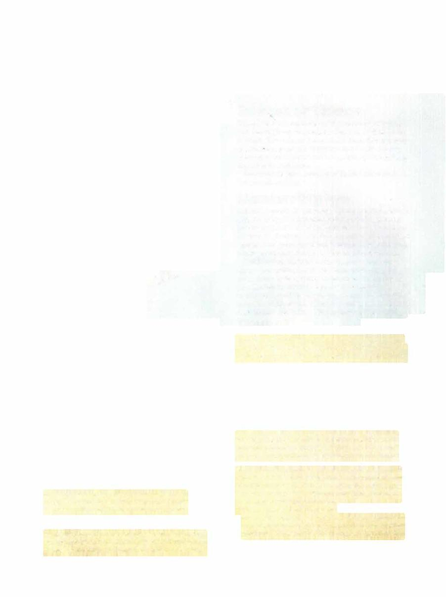

# Abhorrent Overlord



```statblock
layout: Basic 5e Layout
name: Abhorrent Overlord
size: Large
type: fiend
alignment: lawful evil
ac: 16
hp: 136
hit_dice: 16d10 +48
speed: 30 ft., fly 60 ft.
stats:
- 20
- 18
- 16
- 15
- 14
- 16
cr: '9'
ac_class: natural armor
saves:
- constitution: 7
- charisma: 7
skillsaves:
- deception: 7
- intimidation: 7
- persuasion: 7
damage_resistances: cold, necrotic
damage_immunities: poison
condition_immunities: poisoned •
senses: darkvision 120 ft., passive Perception 12
languages: Abyssal, Common, Infernal
traits:
- name: Innate Spellcasting
  desc: 'The abhorrent overlord''s spellcasting ability is Charisma (spell save DC 15). It can innately cast the following spells, requiring no material components:


    1/day each: confusion, crown of madness, suggestion'
- name: Insatiable Greed
  desc: 'The abhorrent overlord can sense the presence of gold within 1,000 feet of itself. It can determine which location has the greatest amount of gold and can sense the


    direction to that site. If the gold is being moved, it knows the direction of the movement. It can''t locate gold if any thickness of clay or lead, even a thin sheet, blocks a direct path between it and the gold.'
- name: Magic Resistance
  desc: The abhorrent overlord has advantage on saving throws against spells and other magical effects.
actions:
- name: Multiattack
  desc: The abhorrent overlord makes two attacks with its claws.
- name: Claws
  desc: 'Melee Weapon Attack: +9 to hit, reach 5 ft., one target. Hit: 14 (2d8 +5) slashing damage plus 14 (4d6) necrotic damage. The abhorrent overlord regains hit points equal to half the amount of necrotic damage dealt if the target is a creature .'
- name: Storm of Crows (Recharge 6)
  desc: The abhorrent overlord conjures a swarm of spectral crows and harpies in a 20-foot-radius sphere centered on a point the overlord can see within 120 feet of it. The sphere remains for 1 minute or until the overlord loses concentration (as if concentrating on a spell), and its area is lightly obscured and difficult terrain. Any creature that moves into the area for the first time on a turn or starts its turn there must make a DC 15 Constitution saving throw. A creature takes 16 (3d10) slashing damage plus 16 (3d10) psychic damage on a failed save, or half as much damage on a successful one.
```

*Large fiend, lawful evil*

[[../Monsters Glossary|← Monsters Glossary]]

## Source

- [Mythic Odysseys of Theros, p. 219](source_book.pdf#page=219)
