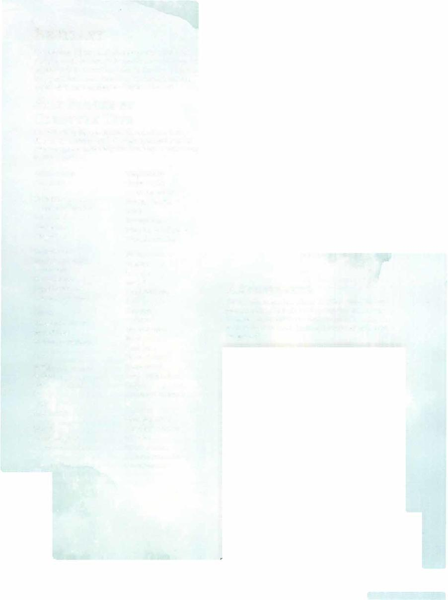

# Amphisbaena



```statblock
layout: Basic 5e Layout
name: Amphisbaena
size: Medium
type: monstrosity
alignment: unaligned
ac: 14
hp: 11
hit_dice: 2d8 +2
speed: 30 ft., swim 30 ft.
stats:
- 14
- 18
- 12
- 3
- 10
- 3
cr: 1/2
skillsaves:
- perception: 4
senses: blindsight 10 ft., passive Perception 14
languages: '-'
traits:
- name: Two Heads
  desc: The amphisbaena has advantage on saving throws against being blinded, charmed, deafened, frightened, stunned, and knocked unconscious.
actions:
- name: Multiattack
  desc: The amphisbaena makes two bite attacks.
- name: Bite
  desc: 'Melee Weapon Attack: +6 to hit, reach 5 ft., one target. Hit: 6 (1d4+4) piercing damage and 4 (1d6+1) poison damage.'
```

*Medium monstrosity, unaligned*

[[../Monsters Glossary|← Monsters Glossary]]

## Source

- [Mythic Odysseys of Theros, p. 208](source_book.pdf#page=208)
