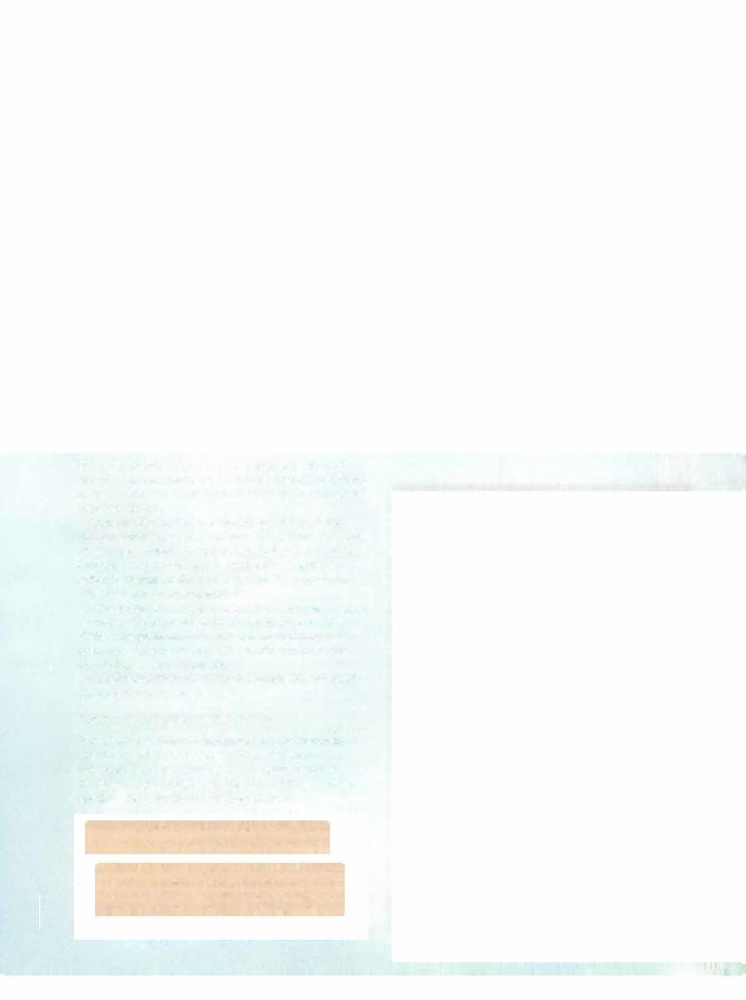

# Anvilwrought Raptor



```statblock
layout: Basic 5e Layout
name: Anvilwrought Raptor
size: Tiny
type: construct
alignment: unaligned
ac: 14
hp: 18
hit_dice: 4d4 +8
speed: 10 ft., fly 60 ft.
stats:
- 12
- 16
- 14
- 3
- 14
- 1
cr: 1/2
ac_class: natural armor
skillsaves:
- perception: 4
damage_immunities: fire, poison
condition_immunities: charmed, exhaustion, paralyzed, petrified, poisoned
senses: darkvision 120 ft., passive Perception 14
languages: understands one language of its creator but can't speak
traits:
- name: Keen Sight
  desc: The raptor has advantage on Wisdom (Perception) checks that rely on sight.
- name: Recorded Mimicry
  desc: The raptor can mimic any sound, including voices, it has heard in the last 24 hours. A creature that hears the sounds can tell they are imitations with a successful DC 12 Wisdom (Insight) check.
actions:
- name: Multiattack
  desc: The raptor makes two attacks with its beak.
- name: Beak
  desc: 'Melee Weapon Attack: +5 to hit, reach 5 ft., one target. Hit: 5 (1d4+3) piercing damage.'
```

*Tiny construct, unaligned*

[[../Monsters Glossary|← Monsters Glossary]]

## Source

- [Mythic Odysseys of Theros, p. 209](source_book.pdf#page=209)
