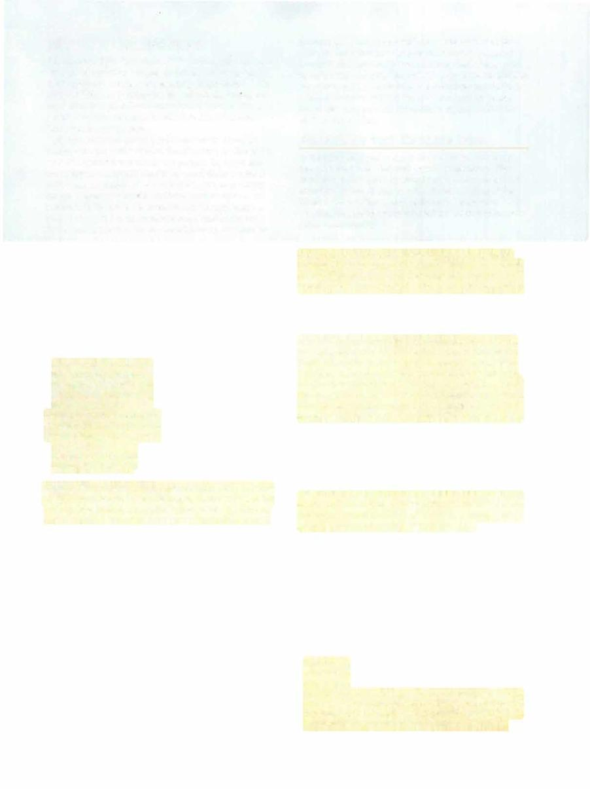

# Arasta



```statblock
layout: Basic 5e Layout
name: Arasta
size: Huge
type: monstrosity
alignment: neutral evil
ac: 19
hp: 300
hit_dice: 24d12 +144
speed: 40 ft., climb 40 ft.
stats:
- 24
- 16
- 23
- 15
- 22
- 17
cr: '21'
ac_class: natural armor
saves:
- dexterity: 10
- constitution: 13
- wisdom: 13
skillsaves:
- arcana: 9
- deception: 10
- intimidation: 10
- nature: 9
- perception: 13
- stealth: 10
damage_resistances: bludgeoning, piercing, and slashing from nonmagical attacks
damage_immunities: acid, poison
condition_immunities: poisoned
senses: blindsight 60 ft., darkvision 120 ft., passive Perception 23
languages: Celestial, Common, Sylvan
traits:
- name: Armor of Spiders (Mythic Trait; Recharges after a Short or Long Rest)
  desc: If Arasta is reduced to 0 hit points, she doesn't die or fall unconscious. Instead, she regains 200 hit points. In addition, Arasta's children immediately swarm over her body to protect her, granting her 100 temporary hit points.
- name: Legendary Resistance (3/Day)
  desc: If Arasta fails a saving throw, she can choose to succeed instead.
- name: Magic Resistance
  desc: Arasta has advantage on saving throws against spells and other magical effects.
- name: Spider Climb
  desc: Arasta can climb difficult surfaces, including upside down on ceilings, without needing to make an ability check.
- name: Web Walker
  desc: Arasta ignores movement restrictions caused by webbing.
actions:
- name: Multiattack
  desc: 'Arasta makes three attacks: one with her bite and two with her claws.'
- name: Bite
  desc: 'Melee Weapon Attack: +14 to hit, reach 5 ft., one creature. Hit: 20 (3d8 +7) piercing damage, and the target must make


    a DC 21 Constitution saving throw, taking 32 (5d12) poison damage on a failed save, or half as much damage on a successful one. If the damage reduces the target to 0 hit points, the target is stable but poisoned for 1 hour, even after regaining hit points, and is paralyzed while poisoned in this way.'
- name: Claws
  desc: 'Melee Weapon Attack: +14 to hit, reach 5 ft., one target. Hit: 17 (3d6 +7) slashing damage.'
- name: Web of Hair (Recharge 4-6)
  desc: Arasta unleashes her hair in the form of webbing that fills a 30-foot cube next to her. The web is difficult terrain, its area is lightly obscured, and it lasts for 1 minute. Any creature that moves into the web or that starts its turn there must make a DC 21 Dexterity saving throw. On a failed save, the creature is restrained while in the web. A creature can use an action to make a DC 21 Strength check. On a success, it can free itself or a creature within 5 feet of it that is restrained by the web. This webbing is immune to all damage except magical fire. A 5-foot cube of the web is destroyed if it takes at least 20 fire damage from a spell or other magical source on a single turn.
legendary_description: Arasta can take 3 legendary actions, choosing from the options below. Only one legendary action option can be used at a time and only at the end of another creature's turn. Arasta regains spent legendary actions at the start of her turn.
legendary_actions:
- name: Claws
  desc: Arasta makes one attack with her claws.
- name: Swarm (Costs 2 Actions)
  desc: Arasta causes two swarms of spiders (see the Monster Manual) to appear in unoccupied spaces within 5 feet of her.
- name: Toxic Web (Costs 3 Actions)
  desc: Each creature restrained by Arasta's Web of Hair takes 18 (4d8) poison damage.
mythic_description: If Arasta's mythic trait is active, she can use the options below as legendary actions, as long as she has temporary hit points from her Armor of Spiders.
mythic_actions:
- name: Swipe
  desc: Arasta makes two attacks with her claws.
- name: Web of Hair (Costs 2 Actions)
  desc: Arasta recharges Web of Hair and uses it.
- name: Nyx Weave (Costs 2 Actions)
  desc: Each creature restrained by Arasta's Web of Hair must succeed on a DC 21 Constitution saving throw, or the creature takes 26 (4d12) force damage and any spell of 6th level or lower on it ends.
```

*Huge monstrosity, neutral evil*

[[../Monsters Glossary|← Monsters Glossary]]

## Source

- [Mythic Odysseys of Theros, p. 248](source_book.pdf#page=248)
