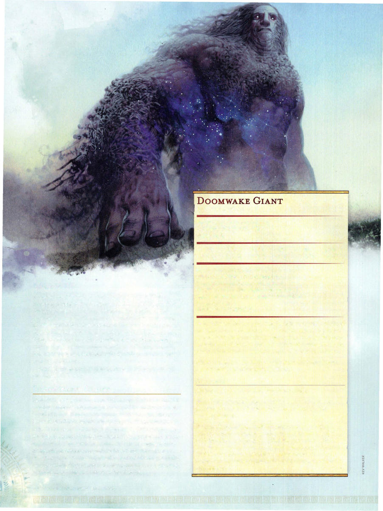

# Doomwake Giant

```statblock
layout: Basic 5e Layout
name: Doomwake Giant
size: Huge
type: giant
alignment: lawful evil
ac: 15
hp: 162
hit_dice: 13d12 +78
speed: 40 ft.
stats:
- 24
- 12
- 22
- 12
- 14
- 16
cr: '11'
ac_class: natural armor
saves:
- constitution: 10
- wisdom: 6
skillsaves:
- intimidation: 7
- perception: 6
damage_immunities: necrotic, poison
condition_immunities: frightened, poisoned
senses: darkvision 120 ft., passive Perception 16
languages: G iant
traits:
- name: Aura of Erebos
  desc: Any creature that starts its turn within 10 feet of the giant must succeed on a DC 18 Constitution saving throw, or it takes 10 (3d6) necrotic damage and can't regain hit points until the start of its next turn. On a successful saving throw, the creature is immune to the giant's Aura of Erebos for 24 hours.
- name: Magic Resistance
  desc: The giant has advantage on saving throws against spells and other magical effects.
actions:
- name: Multiattack
  desc: The giant makes two slam attacks.
- name: Slam
  desc: 'Melee Weapon Attack: +11 to hit, reach 15 ft., one target. Hit: 20 (3d8 +7) bludgeoning damage plus 10 (3d6) necrotic damage.'
- name: Noxious Gust (Recharge 5-6)
  desc: 'The giant exhales a mighty gust that creates a blast of deadly mist in a 60-foot line that is 10 feet wide. Each creature in that line must make a DC 18


    Constitution saving throw. On a failed save, the creature takes 36 (8d8) necrotic damage and is knocked prone. On a successful save, a creature takes half as much damage and isn''t knocked prone .'
```

*Huge giant, lawful evil*

[[../Monsters Glossary|← Monsters Glossary]]



## Source

- [Mythic Odysseys of Theros, p. 224](source_book.pdf#page=224)
