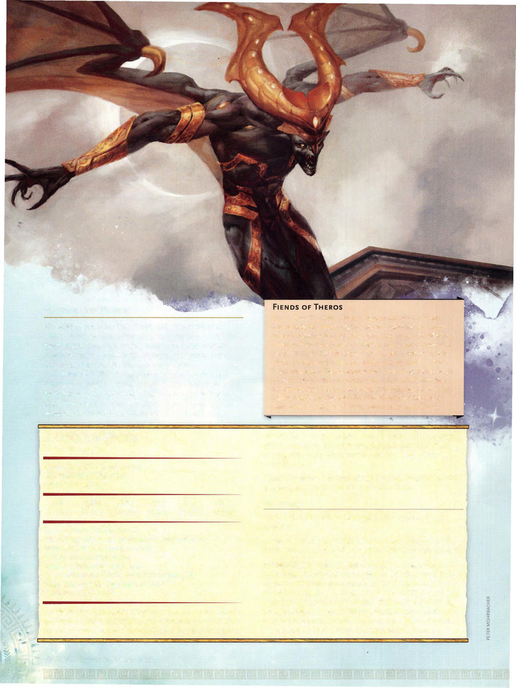

# Eater of Hope



```statblock
layout: Basic 5e Layout
name: Eater of Hope
size: Large
type: fiend
alignment: lawful evil
ac: 17
hp: 90
hit_dice: 12d10 +24
speed: 30 ft., fly 60 ft.
stats:
- 19
- 17
- 14
- 12
- 11
- 16
cr: '6'
ac_class: natural armor
saves:
- constitution: 5
- charisma: 6
skillsaves:
- deception: 6
- i ntimidation: 6
- persuasion: 6
damage_resistances: cold, necrotic
damage_immunities: poison
condition_immunities: poisoned
senses: darkvision 120 ft., passive Perception 10
languages: Abyssal, Common, I nfernal
traits:
- name: Insatiable Greed
  desc: 'The eater of hope can sense the presence of gold within 1,000 feet of itself. It can determine which location has the greatest amount of gold and can sense the direction


    to that site. If the gold is being moved, it knows the direction of the movement. It can''t locate gold if any thickness of clay or lead, even a thin sheet, blocks a direct path between it and the gold.'
- name: Magic Resistance
  desc: The eater of hope has advantage on saving throws against spells and other magical effects.
actions:
- name: Multiattack
  desc: The eater of hope makes two attacks with its claws.
- name: Claws
  desc: 'Melee Weapon Attack: +7 to hit, reach 5 ft., one target. Hit: 8 (1d8+4) slashing damage plus 7 (2d6) necrotic damage.'
- name: Breath of Hopelessness (Recharge 5-6)
  desc: The eater of hope exhales a miasma of U nderworld winds in a 30-foot cone. Each creature in that area must make a DC 14 Charisma saving throw. On a failed save, the target takes 26 (4d12) necrotic damage and is cursed for 1 minute. While cursed in this way, the target takes an extra 6 (1d12) necrotic damage whenever the eater of hope hits it with an attack. On a successful save, the target takes half as much damage and isn't cursed.
```

*Large fiend, lawful evil*

[[../Monsters Glossary|← Monsters Glossary]]

## Source

- [Mythic Odysseys of Theros, p. 220](source_book.pdf#page=220)
