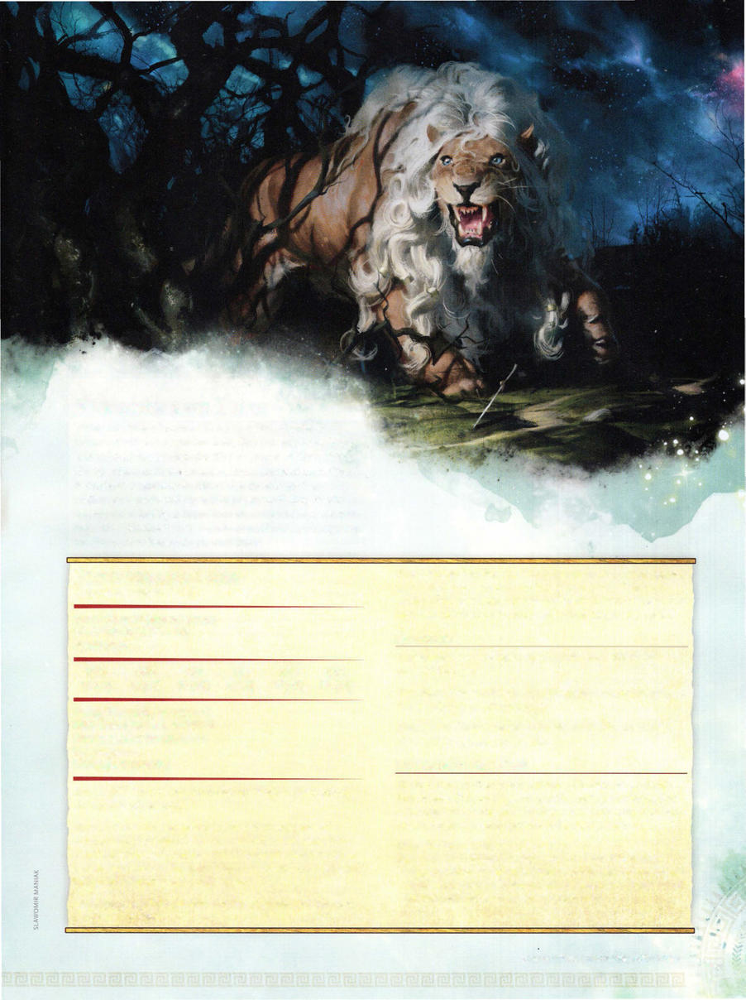

# Fleecemane Lion



```statblock
layout: Basic 5e Layout
name: Fleecemane Lion
size: Large
type: monstrosity
alignment: unaligned
ac: 15
hp: 45
hit_dice: 6d10 +12
speed: 50 ft.
stats:
- 19
- 16
- 14
- 6
- 14
- 10
cr: '3'
ac_class: natural armor
saves:
- strength: 6
- constitution: 4
skillsaves:
- perception: 4
- stealth: 5
senses: passive Perception 14
languages: '-'
traits:
- name: Keen Smell
  desc: The lion has advantage on Wisdom (Perception) checks that rely on smell.
- name: Pounce
  desc: If the lion moves at least 20 feet straight toward a creature and then hits it with a claw attack on the same turn, that target must succeed on a DC 14 Strength saving throw or be knocked prone. If the target is prone, the lion can make one bite attack against it as a bonus action.
- name: Running Leap
  desc: With a 10-foot running start, the lion can long jump up to 25 feet.
- name: Spell Turning
  desc: The lion has advantage on saving throws against any spell that targets only the lion (not an area). If the lion's saving throw succeeds and the spell is of 4th level or lower, the spell has no effect on the lion and instead targets the caster.
actions:
- name: Multiattack
  desc: 'The lion makes two attacks: one with its bite and one with its claw.'
- name: Bite
  desc: 'Melee Weapon Attack: +6 to hit, reach 5 ft., one target. Hit: 8 (1d8+4) piercing damage.'
- name: Claw
  desc: 'Melee Weapon Attack: +6 to hit, reach 5 ft., one target. Hit: 7 (1d6+4) slashing damage.'
legendary_description: The lion can take 2 legendary actions, choosing from the options below. Only one legendary action option can be used at a time and only at the end of another creature's turn. The lion regains spent legendary actions at the start of its turn.
legendary_actions:
- name: Claw
  desc: The lion makes one claw attack.
- name: Roar (Costs 2 Actions)
  desc: The lion emits a magical roar. Each creature within 60 feet of the lion that can hear the roar must succeed on a DC 12 Wisdom saving throw or be frightened of the lion until the end of the l ion's next turn.
```

*Large monstrosity, unaligned*

[[../Monsters Glossary|← Monsters Glossary]]

## Source

- [Mythic Odysseys of Theros, p. 223](source_book.pdf#page=223)
