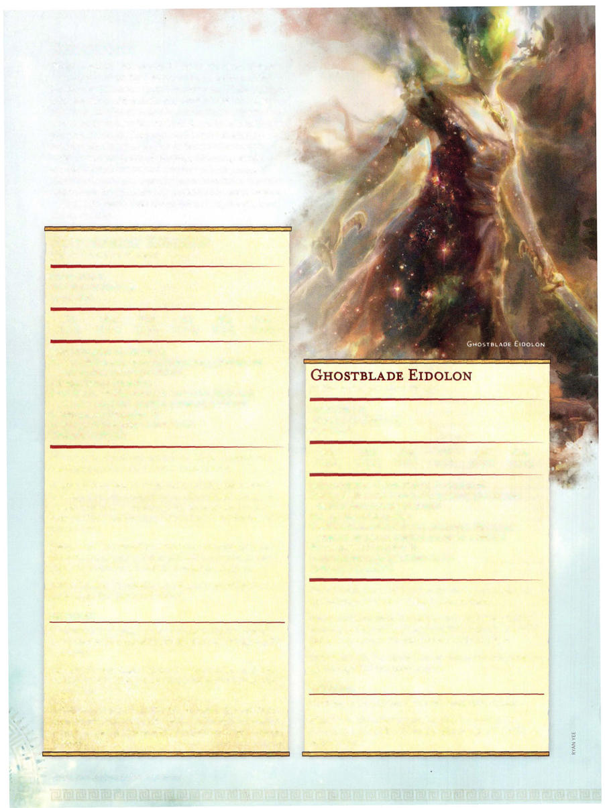

# Flitterstep Eidolon



```statblock
layout: Basic 5e Layout
name: Flitterstep Eidolon
size: Medium
type: undead
alignment: any alignment
ac: 14
hp: 44
hit_dice: 8d8 +8
speed: 40 ft.
stats:
- 8
- 18
- 13
- 11
- 12
- 10
cr: '3'
skillsaves:
- perception: 3
- stealth: 8
damage_resistances: necrotic; bludgeoning, piercing, and slashing from nonmagical attacks
damage_immunities: poison
condition_immunities: charmed, exhaustion, frightened, grappled, paralyzed, petrified, poisoned, restrained
senses: passive Perception 13
languages: the languages it knew in life
traits:
- name: Blurred Form
  desc: Attack rolls against the eidolon are made with disadvantage unless the eidolon is incapacitated.
- name: Evasion
  desc: If the eidolon is subjected to an effect that allows it to make a Dexterity saving throw to take only half damage, the eidolon instead takes no damage if it succeeds on the saving throw, and only half damage if it fails. It can't use this trait if it's incapacitated.
- name: Incorporeal Movement
  desc: The eidolon can move through other creatures and objects as if they were difficult terrain. It takes 5 (1d10) force damage if it ends its turn inside an object.
- name: Turn Resistance
  desc: The eidolon has advantage on saving throws against any effect that turns undead.
actions:
- name: Multiattack
  desc: The eidolon makes two melee attacks. Immediately before or after one of its attacks, it can use Flitterstep if it is available.
- name: Flickering Dagger
  desc: 'Melee Weapon Attack: +6 to hit, reach 5 ft., one target. Hit: 6 (1d4+4) piercing damage plus 3 (1d6) psychic damage.'
- name: Flitterstep (Recharge 5-6)
  desc: The eidolon magically teleports to an unoccupied space it can see within 30 feet of it. If it makes an attack immediately after teleporting, it has advantage on the attack roll.
```

*Medium undead, any alignment*

[[../Monsters Glossary|← Monsters Glossary]]

## Source

- [Mythic Odysseys of Theros, p. 222](source_book.pdf#page=222)
