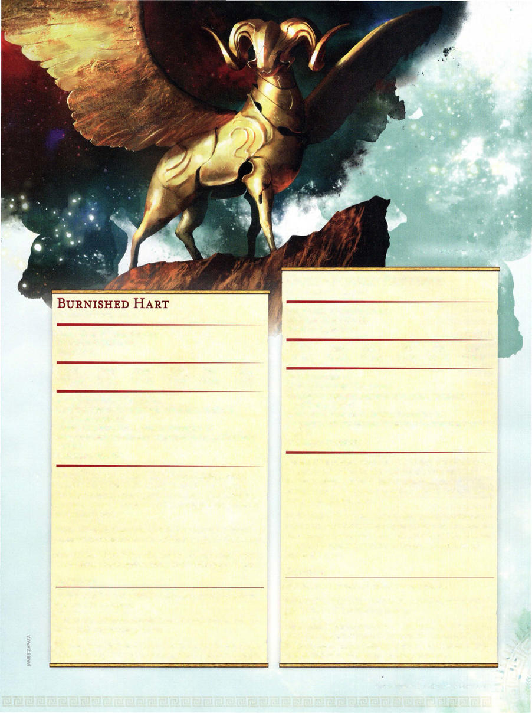

# Gold-Forged Sentinel



```statblock
layout: Basic 5e Layout
name: Gold-Forged Sentinel
size: Large
type: construct
alignment: unaligned
ac: 16
hp: 76
hit_dice: 8d10 +32
speed: 40 ft., fly 60 ft.
stats:
- 18
- 13
- 19
- 3
- 16
- 10
cr: '5'
ac_class: natural armor
skillsaves:
- perception: 6
damage_immunities: fire, poison
condition_immunities: charmed, exhaustion, paralyzed, petrified, poisoned
senses: darkvision 120 ft., passive Perception 16
languages: understands one language of its creator but can't speak
traits:
- name: Charge
  desc: If the sentinel moves at least 20 feet straight toward a target and then hits it with a ram attack on the same turn, the target takes an extra 10 (3d6) bludgeoning damage. If the target is a creature, it must succeed on a DC 15 Strength saving throw or be knocked prone.
- name: Spell Turning
  desc: The sentinel has advantage on saving throws against any spell that targets only the sentinel (not an area). If the sentinel's saving throw succeeds and the spell is of 4th level or lower, the spell has no effect on the sentinel and instead targets the caster.
actions:
- name: Multiattack
  desc: The sentinel makes two ram attacks.
- name: Ram
  desc: 'Melee Weapon Attack: +7 to hit, reach 5 ft., one target. Hit: 13 (2d8 +4) bludgeoning damage.'
- name: Fire Breath (Recharge 5-6)
  desc: The sentinel exhales fire in a 15-foot cone. Each creature in that area must make a DC 15 Dexterity saving throw, taking 27 (6d8) fire damage on a failed save, or half as much damage on a successful one.
```

*Large construct, unaligned*

[[../Monsters Glossary|← Monsters Glossary]]

## Source

- [Mythic Odysseys of Theros, p. 211](source_book.pdf#page=211)
