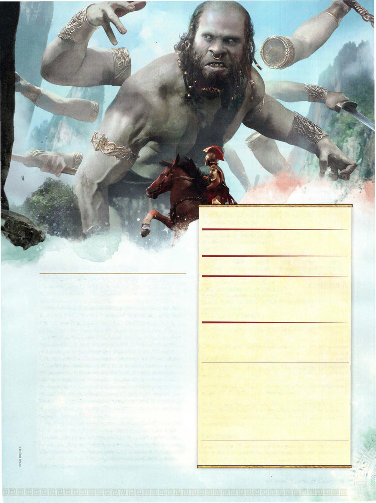

# Hundred-Handed One



```statblock
layout: Basic 5e Layout
name: Hundred-Handed One
size: Huge
type: giant
alignment: lawful neutral
ac: 15
hp: 243
hit_dice: 18d12 +126
speed: 40 ft.
stats:
- 26
- 15
- 25
- 14
- 16
- 16
cr: '15'
ac_class: natural armor
saves:
- constitution: 12
- wisdom: 8
skillsaves:
- intimidation: 8
- perception: 8
condition_immunities: frightened
senses: darkvision 120 ft., passive Perception 18
languages: G iant
traits:
- name: Reactive
  desc: The giant can take one reaction on every turn in a combat.
- name: Vigilant
  desc: The giant can't be surprised.
actions:
- name: Multiattack
  desc: The giant makes four longsword attacks or two rock attacks.
- name: Longsword
  desc: 'Melee Weapon Attack: +13 to hit, reach 15 ft., one target. Hit: 21 (3d8 +8) slashing damage.'
- name: Rock
  desc: 'Ranged Weapon Attack: +13 to hit, range 60/240 ft., one target. Hit: 30 (4d10 +8) bludgeoning damage. If the target is a creature, it must succeed on a DC 21 Strength saving throw or be knocked prone.'
reactions:
- name: Deflect Attack
  desc: The giant adds 5 to its AC against one weapon attack that would hit it. To do so, the giant must see the attacker and be wielding a melee weapon.
```

*Huge giant, lawful neutral*

[[../Monsters Glossary|← Monsters Glossary]]

## Source

- [Mythic Odysseys of Theros, p. 225](source_book.pdf#page=225)
