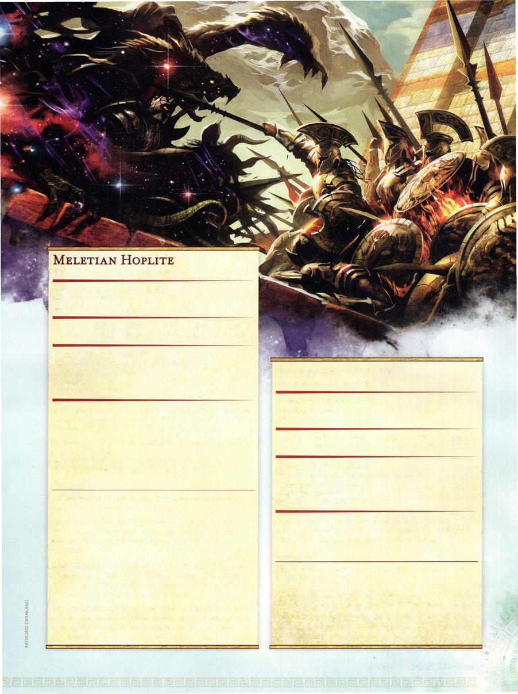

# Meletian Hoplite



```statblock
layout: Basic 5e Layout
name: Meletian Hoplite
size: Medium
type: humanoid (any)
alignment: any alignment
ac: 18
hp: 49
hit_dice: 9d8 +9
speed: 30 ft.
stats:
- 16
- 14
- 12
- 16
- 13
- 11
cr: '3'
ac_class: breastplate, shield
saves:
- dexterity: 4
- intelligence: 5
skillsaves:
- arcana: 5
- history: 5
- perception: 3
senses: passive Perception 13
languages: Common
traits:
- name: Spellcasting
  desc: 'The hoplite is a 3rd-level spellcaster. Its spellcasting ability is Intelligence (spell save DC 13, +5 to hit with spell attacks). It has the following wizard spells prepared:


    Cantrips (at will): mage hand, minor illusion, ray of frost (see "Actions" below) 1st level (4 slots): color spray, expeditious retreat, sleep 2nd level (2 slots): blur, cloud of daggers, invisibility'
actions:
- name: Multiattack
  desc: The hoplite makes three weapon attacks. It can replace one weapon attack with ray of frost.
- name: Spear
  desc: 'Melee or Ranged Weapon Attack: +5 to hit, reach 5 ft., one target. Hit: 6 (1d6+3) piercing damage, or 7 (1d8 +3) piercing damage if used with two hands to make a melee attack.'
- name: Shield Bash
  desc: 'Melee Weapon Attack: +5 to hit, reach 5 ft., one creature. Hit: 5 (1d4+3) bludgeoning damage. If the target is a Medium or smaller creature, it must succeed on a DC 13 Strength saving throw or be knocked prone.'
- name: Ray of Frost (Cantrip)
  desc: 'Ranged Spell Attack: +5 to hit, range 60 ft., one creature. Hit: 4 (1d8) cold damage, and the target''s speed is reduced by 10 feet until the start of the hoplite''s next turn.'
```

*Medium humanoid (any), any alignment*

[[../Monsters Glossary|← Monsters Glossary]]

## Source

- [Mythic Odysseys of Theros, p. 229](source_book.pdf#page=229)
