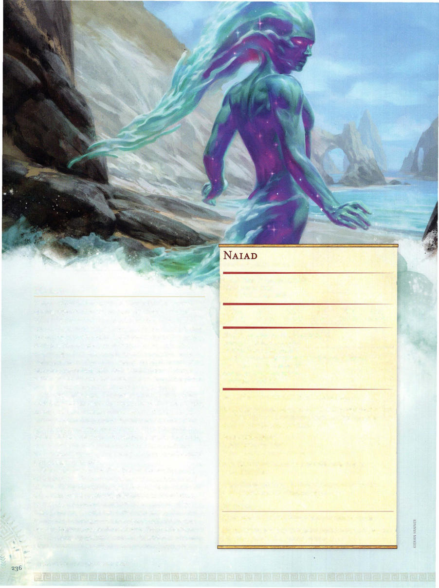

# Naiad



```statblock
layout: Basic 5e Layout
name: Naiad
size: Medium
type: fey
alignment: chaotic neutral
ac: 15
hp: 31
hit_dice: 7d8
speed: 30 ft., swim 30 ft.
stats:
- 10
- 16
- 11
- 15
- 10
- 18
cr: '2'
ac_class: natural armor
skillsaves:
- persuasion: 6
- sleight of hand: 5
damage_resistances: psychic
damage_immunities: poison
condition_immunities: charmed, frightened, poisoned
senses: passive Perception 10
languages: Common, Sylvan
traits:
- name: Amphibious
  desc: The naiad can breathe air and water.
- name: Innate Spellcasting
  desc: 'The naiad''s spellcasting ability is Charisma (spell save DC 14). It can innately cast the following spells, requiring no material components:


    At will: minor illusion 3/day: phantasmal force 1/day each: fly, hypnotic pattern'
- name: Invisible in Water
  desc: The naiad is invisible while fully immersed in water.
- name: Magic Resistance
  desc: The naiad has advantage on saving throws against spells and other magical effects.
actions:
- name: Multiattack
  desc: The naiad makes two psychic touch attacks.
- name: Psychic Touch
  desc: 'Melee Spell Attack: +6 to hit, reach 5 ft., one target. Hit: 9 (1d10+4) psychic damage.'
```

*Medium fey, chaotic neutral*

[[../Monsters Glossary|← Monsters Glossary]]

## Source

- [Mythic Odysseys of Theros, p. 236](source_book.pdf#page=236)
