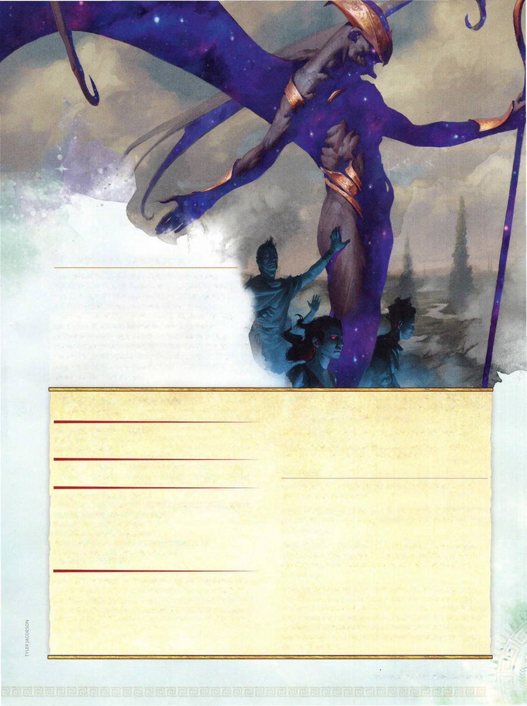

# Nightmare Shepherd



```statblock
layout: Basic 5e Layout
name: Nightmare Shepherd
size: Large
type: fiend
alignment: lawful evil
ac: 18
hp: 133
hit_dice: 14d10 +56
speed: 30 ft., fly 60 ft.
stats:
- 19
- 15
- 18
- 14
- 17
- 20
cr: '11'
ac_class: natural armor
saves:
- constitution: 8
- wisdom: 7
skillsaves:
- arcana: 6
- deception: 9
- perception: 7
- persuasion: 9
damage_resistances: cold, necrotic
damage_immunities: poison
condition_immunities: poisoned
senses: darkvision 120 ft., passive Perception 17
languages: Abyssal, Common, Infernal
traits:
- name: Aura of Nightmares
  desc: Undead creatures within 30 feet of the shepherd gain a +5 bonus to attack and damage rolls. When any other creature that isn't undead or a construct starts its turn within 30 feet of the shepherd, that creature must succeed on a DC 17 Wisdom saving throw or take 11 (2d10) psychic damage.
- name: Innate Spellcasting
  desc: 'The shepherd''s spellcasting ability is


    Charisma (spell save DC 17). It can innately cast the following spells, requiring no material components:


    1/day each: confusion, dispel magic, hold person, suggestion'
- name: Magic Resistance
  desc: The shepherd has advantage on saving throws against spells and other magical effects.
actions:
- name: Multiattack
  desc: 'The shepherd makes two attacks: one with its claws and one with its staff.'
- name: Claws
  desc: 'Melee Weapon Attack: +8 to hit, reach 5 ft., one target. Hit: 13 (2d8 +4) slashing damage plus 16 (3d10) necrotic damage.'
- name: Staff
  desc: 'Melee Weapon Attack: +8 to hit, reach 5 ft., one target. Hit: 11 (2d6 +4) bludgeoning damage, or 13 (2d8 +4) bludgeoning damage if used with two hands, plus 26 (4d12) psychic damage.'
- name: Herd the Underworld (Recharges after a Short or Long Rest)
  desc: The shepherd pulls twisted souls from the Underworld; 1d6 shadows (without Sunlight Weakness; see the Monster Manual) arise in unoccupied spaces within 20 feet of the shepherd . The shadows act right after the shepherd on the same initiative count and fight until they're destroyed. They disappear when the shepherd dies.
```

*Large fiend, lawful evil*

[[../Monsters Glossary|← Monsters Glossary]]

## Source

- [Mythic Odysseys of Theros, p. 221](source_book.pdf#page=221)
