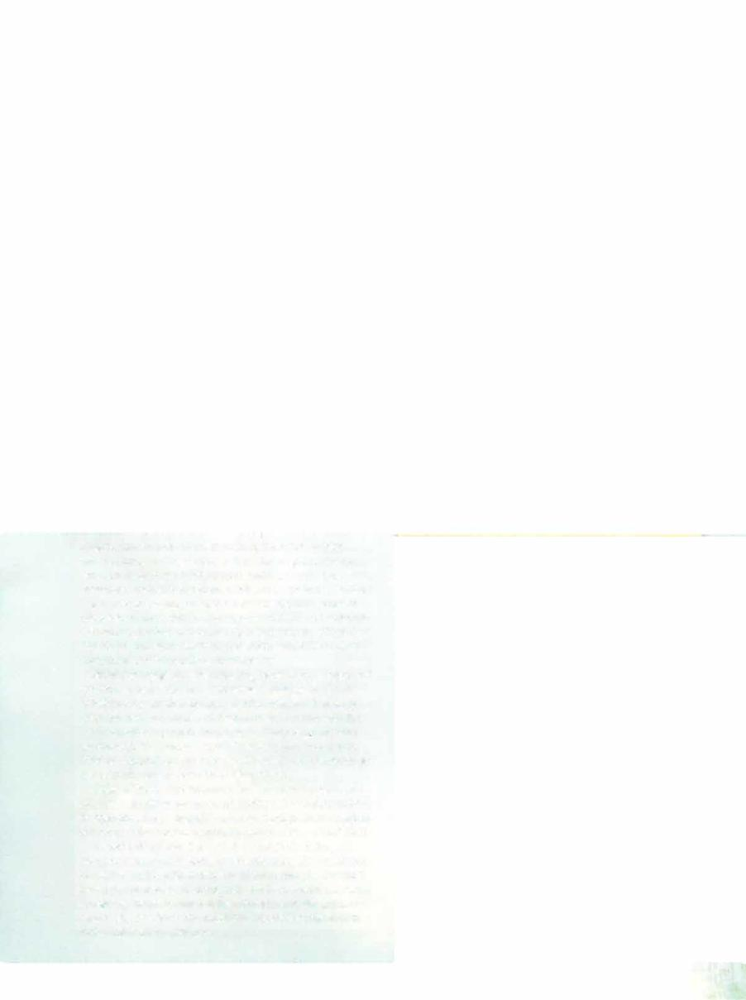

# Oread



```statblock
layout: Basic 5e Layout
name: Oread
size: Medium
type: fey
alignment: chaotic evil
ac: 16
hp: 49
hit_dice: 9d8 +9
speed: 30 ft.
stats:
- 14
- 14
- 12
- 11
- 13
- 18
cr: '4'
ac_class: natural armor
skillsaves:
- athletics: 4
- acrobatics: 4
- performance: 6
damage_immunities: fire, poison
condition_immunities: charmed, frightened, poisoned
senses: passive Perception 11
languages: Common, Sylvan
traits:
- name: Innate Spellcasting
  desc: 'The oread''s spellcasting ability is Charisma (spell save DC 14, +6 to hit with spell attacks). It can innately cast the following spells, requiring no material components:


    At will: fire bolt (see "Actions" below) 3/day: burning hands 1/day each: hellish rebuke (see " Reactions" below), scorching ray'
- name: Invisible in Fire
  desc: The oread is invisible while fully immersed in fire.
- name: Magic Resistance
  desc: The oread has advantage on saving throws against spells and other magical effects.
actions:
- name: Multiattack
  desc: The oread attacks twice with its fiery touch or fire bolt.
- name: Fiery Touch
  desc: 'Melee Spell Attack: +6 to hit, reach 5 ft., one target. Hit: 9 (1d10+4) fire damage.'
- name: Fire Bolt (Cantrip)
  desc: 'Ranged Spell Attack: +6 to hit, range 120 ft., one target. Hit: 5 (1d10) fire damage.'
reactions:
- name: Hellish Rebuke (2nd-Level Spell; 1/Day)
  desc: When the oread is damaged by a creature within 60 feet of the oread that it can see, the creature that damaged the oread must make a DC 14 Dexterity saving throw, taking 16 (3d10) fire damage on a failed save, or half as much damage on a successful one.
```

*Medium fey, chaotic evil*

[[../Monsters Glossary|← Monsters Glossary]]

## Source

- [Mythic Odysseys of Theros, p. 237](source_book.pdf#page=237)
