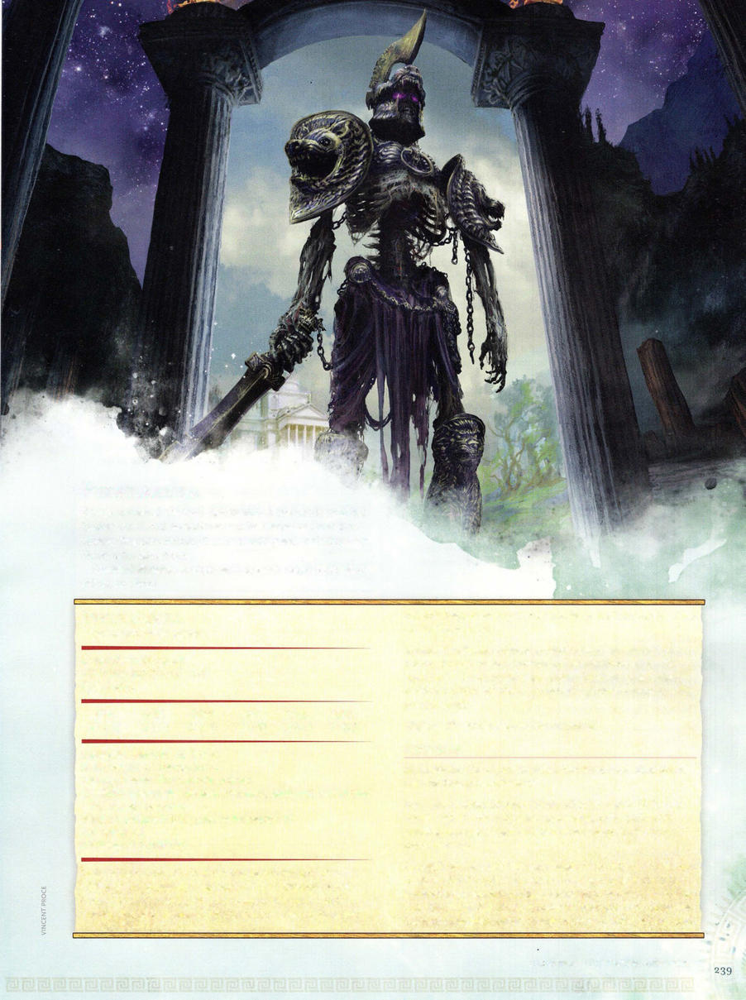

# Phylaskia



```statblock
layout: Basic 5e Layout
name: Phylaskia
size: Large
type: undead
alignment: lawful neutral
ac: 18
hp: 104
hit_dice: 11d10 +44
speed: 40 ft.
stats:
- 20
- 15
- 18
- 10
- 16
- 14
cr: '9'
ac_class: plate
saves:
- constitution: 8
- wisdom: 7
skillsaves:
- insight: 7
- perception: 7
damage_immunities: necrotic, poison
condition_immunities: blinded, charmed, deafened, exhaustion, frightened, poisoned
senses: truesight 120 ft., passive Perception 17
languages: all
traits:
- name: Gatekeeper's Aura
  desc: 'Any creature that starts its turn within 10 feet of the phylaskia must make a DC 15 Wisdom saving throw. On a successful save, the creature is immune to this aura for the next 24 hours. On a failed save, the creature has


    disadvantage on saving throws and its speed is halved until the start of its next turn.'
- name: Undead Fortitude
  desc: If damage reduces the phylaskia to 0 hit points, it must make a Constitution saving throw with a DC equal to 5 + the damage taken, unless the damage is radiant or from a critical hit. On a success, the phylaskia drops to l hit point instead.
- name: Vigilant
  desc: The phylaskia can't be surprised.
actions:
- name: Multiattack
  desc: The phylaskia makes two longsword attacks and uses its Strength Drain once.
- name: Longsword
  desc: 'Melee Weapon Attack: +9 to hit, reach 10 ft., one target. Hit: 14 (2d8 +5) slashing damage, or 16 (2d10 +5) slashing damage if used with two hands, plus 11 (2d10) necrotic damage.'
- name: Strength Drain
  desc: 'Melee Weapon Attack: +9 to hit, reach 5 ft., one creature. Hit: 12 (2d6 +5) necrotic damage. Unless the target is immune to necrotic damage, its Strength score is reduced by 1d4. The target dies if this reduces its Strength to 0. Otherwise, the reduction lasts until the target finishes a short or long rest.'
```

*Large undead, lawful neutral*

[[../Monsters Glossary|← Monsters Glossary]]

## Source

- [Mythic Odysseys of Theros, p. 239](source_book.pdf#page=239)
