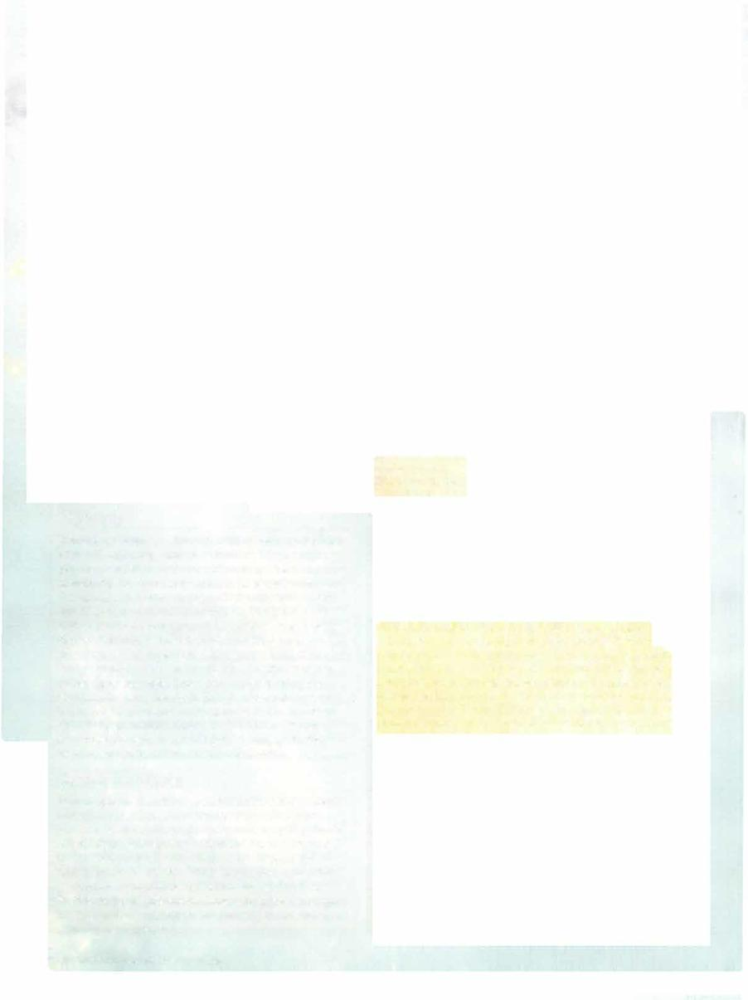

# Satyr Reveler



```statblock
layout: Basic 5e Layout
name: Satyr Reveler
size: Medium
type: fey
alignment: chaotic neutral
ac: 13
hp: 33
hit_dice: 6d8 +6
speed: 40 ft.
stats:
- 12
- 16
- 13
- 12
- 10
- 16
cr: '1'
skillsaves:
- acrobatics: 5
- performance: 7
- stealth: 5
senses: passive Perception 10
languages: Common, Sylvan
traits:
- name: Enthralling Performance
  desc: If the satyr performs for at least 1 minute, it chooses up to four humanoids within 60 feet of it who watched or listened to the entire performance. Each target must succeed on a DC 13 Wisdom saving throw or be charmed. While charmed in this way, the target idolizes the satyr and will take part in the satyr's revels. The charmed condition ends for the creature after 1 hour, if it takes any damage, if the satyr attacks the target, or if the target witnesses the satyr attacking or damaging any of the target's allies.
- name: Magic Resistance
  desc: The satyr has advantage on saving throws against spells and other magical effects.
- name: Sleepless Reveler
  desc: Magic can't put the satyr to sleep.
actions:
- name: Multiattack
  desc: The satyr makes two ram attacks o r two shortbow attacks.
- name: Ram
  desc: 'Melee Weapon Attack: +3 to hit, reach 5 ft., one target. Hit: 6 (2d4 +1) bludgeoning damage.'
- name: Shortbow
  desc: 'Ranged Weapon Attack: +5 to hit, range 80/320 ft., one target. Hit: 6 (1d6+3) piercing damage.'
```

*Medium fey, chaotic neutral*

[[../Monsters Glossary|← Monsters Glossary]]

## Source

- [Mythic Odysseys of Theros, p. 242](source_book.pdf#page=242)
