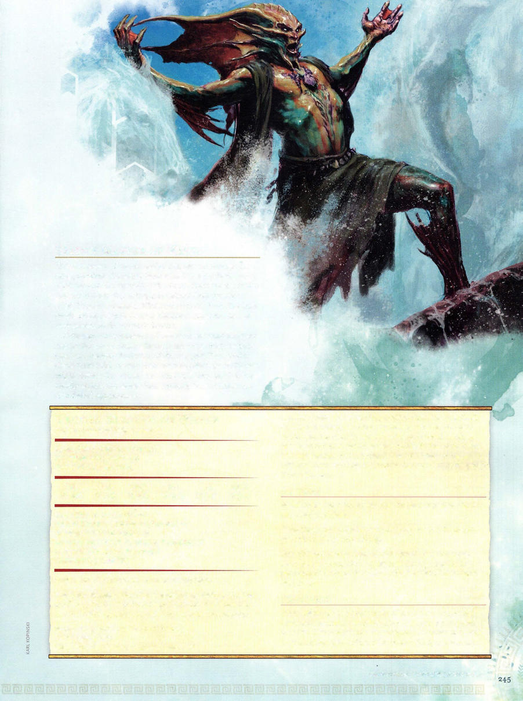

# Triton Master of Waves



```statblock
layout: Basic 5e Layout
name: Triton Master of Waves
size: Medium
type: humanoid (triton)
alignment: neutral
ac: 15
hp: 105
hit_dice: 14d8 +42
speed: 30 ft., swim 30 ft.
stats:
- 16
- 11
- 16
- 10
- 12
- 19
cr: '8'
ac_class: natural armor
skillsaves:
- athletics: 6
- nature: 6
- survival: 4
damage_resistances: cold, fire
senses: darkvision 60 ft., passive Perception 11
languages: Common, Primordial
traits:
- name: Amphibious
  desc: The triton can breathe air and water.
- name: Innate Spellcasting
  desc: 'The triton''s spellcasting ability is Charisma (spell save DC 15, +7 to hit with spell attacks). It can innately cast the following spells, requiring no material components:


    At will: ray of frost (see "Actions" below) 2/day: cone of cold 1/day each:fog cloud, gust of wind, wind wall'
- name: Summon Water Weird (Recharges after a Short or Long Rest)
  desc: As a bonus action, the triton magically summons 1d4water weirds (see the Monster Manual). The summoned weirds appear in unoccupied spaces in water within 60 feet of the triton. The water weirds act immediately after the triton on the same initiative count and fight until they're destroyed. They disappear if the triton dies.
actions:
- name: Multiattack
  desc: The triton makes two attacks using Wave Touch and casts ray of frost.
- name: Wave Touch
  desc: 'Melee Spell Attack: +7 to hit, reach 5 ft., one target. Hit: 22 (4d10) cold damage.'
- name: Ray of Frost (Cantrip)
  desc: 'Ranged Spell Attack: +7 to hit, range 60 ft., one creature. Hit: 13 (3d8) cold damage, and the target''s speed is reduced by 10 feet until the start of the triton''s next turn.'
reactions:
- name: Frigid Shield
  desc: When a creature the triton can see targets the triton with an attack, the triton gains 10 temporary hit points. If the attack hits and reduces the temporary hit points to 0, each creature within 5 feet of the triton takes 9 (2d8) cold damage.
```

*Medium humanoid (triton), neutral*

[[../Monsters Glossary|← Monsters Glossary]]

## Source

- [Mythic Odysseys of Theros, p. 245](source_book.pdf#page=245)
