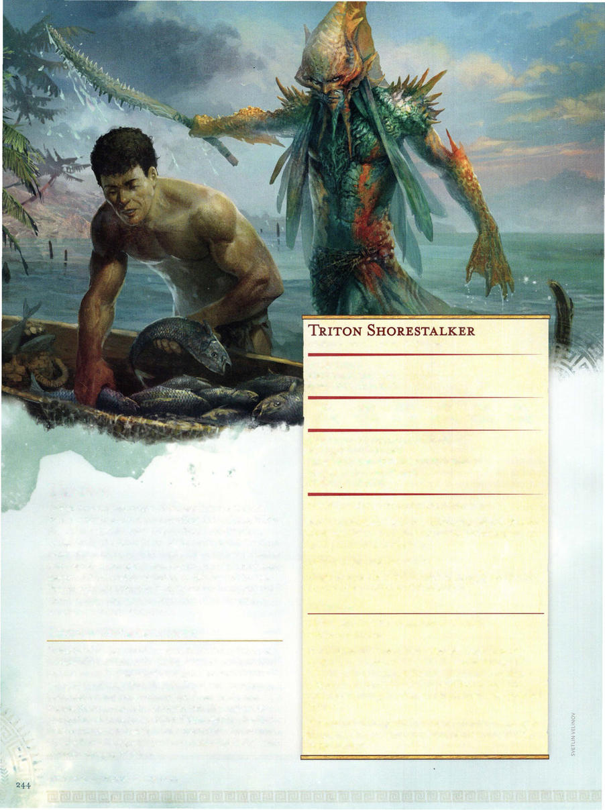

# Triton Shorestalker



```statblock
layout: Basic 5e Layout
name: Triton Shorestalker
size: Medium
type: humanoid (triton)
alignment: neutral evil
ac: 13
hp: 32
hit_dice: 5d8 +10
speed: 30 ft., swim 30 ft.
stats:
- 11
- 16
- 14
- 10
- 15
- 11
cr: '2'
skillsaves:
- nature: 4
- perception: 4
- stealth: 5
damage_resistances: cold
senses: darkvision 60 ft., passive Perception 14
languages: Common, Primordial
traits:
- name: Amphibious
  desc: The triton can breathe air and water.
- name: Innate Spellcasting
  desc: 'The triton''s spellcasting ability is Wisdom (spell save DC 12). It can innately cast the following spells, requiring no material components:


    1/day each :fog cloud, gust of wind'
- name: Nimble Escape
  desc: The triton can take the Disengage or Hide actions as a bonus action on each of its turns.
actions:
- name: Multiattack
  desc: The triton makes two urchin-spine shortsword attacks.
- name: Urchin-Spine Shortsword
  desc: 'Melee Weapon Attack: +5 to hit, reach 5 ft., one target. Hit: 6 (1d6+3) piercing damage plus 10 (3d6) poison damage. If the damage reduces a creature to 0 hit points, that creature is stable but poisoned for 1 hour, even after regaining hit points, and is paralyzed while poisoned in this way.'
- name: Poisoned Spine
  desc: 'Ranged Weapon Attack: +5 to hit, range 30/60 ft., one target. Hit: 5 (1d4+3) piercing damage plus 10 (3d6) poison damage.'
```

*Medium humanoid (triton), neutral evil*

[[../Monsters Glossary|← Monsters Glossary]]

## Source

- [Mythic Odysseys of Theros, p. 244](source_book.pdf#page=244)
