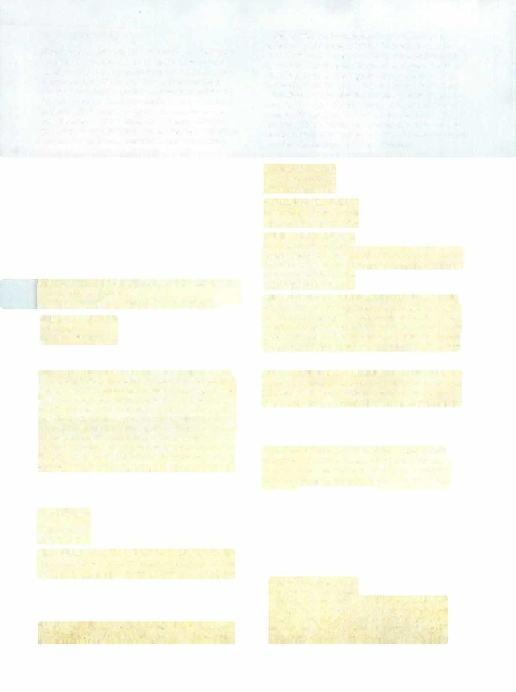

# Tromokratis



```statblock
layout: Basic 5e Layout
name: Tromokratis
size: Gargantuan
type: monstrosity (titan)
alignment: any alignment
ac: 22
hp: 409
hit_dice: 21d20 +189
speed: 30 ft., swim 80 ft.
stats:
- 30
- 11
- 29
- 22
- 11
- 10
cr: '26'
ac_class: natural armor
saves:
- intelligence: 14
- wisdom: 8
damage_resistances: cold, lightning, thunder
damage_immunities: fire; bludgeoning, piercing, and slashing from nonmagical attacks
condition_immunities: charmed, frightened, paralyzed, restrained
senses: blindsight 120 ft., passive Perception 10
languages: '-'
traits:
- name: Amphibious
  desc: Tromokratis can breathe air and water.
- name: Hearts of the Kraken (Mythic Trait; Recharges after a Short or Long Rest)
  desc: 'When Tromokratis is reduced to 0 hit points, it doesn''t die or fall unconscious. Instead, the damage creates cracks in its carapace, revealing its hearts. Tromokratis has four hearts: two on its chest, one on its back, and one at the base of its tail. A heart has an AC of 22 and 100 hit points. It is immune to bludgeoning, piercing, and slashing damage from nonmagical attacks, and it is immune to all conditions. If it is forced to make a saving throw, treat its ability scores as 10 (+0). If i t finishes a short or long rest, the carapace heals, any destroyed hearts regenerate, and the hearts are covered again. Tromokratis dies when all the hearts are destroyed.'
- name: Legendary Resistance (3/Day)
  desc: If Tromokratis fails a saving throw, it can choose to succeed instead.
- name: Magic Weapons
  desc: Tromokratis's weapon attacks are magical.
- name: Siege Monster
  desc: Tromokratis deals double damage to objects and structures.
- name: Spell-Resistant Carapace
  desc: Tromokratis has advantage on saving throws against spells, and any creature that makes a spell attack against Tromokratis has disadvantage on the attack roll.
actions:
- name: Multiattack
  desc: 'Tromokratis makes three attacks: one with its pincer, one with its tail, and one with its tentacle grasp.'
- name: Pincer
  desc: 'Melee Weapon Attack: +18 to hit, reach 20 ft., one target. Hit: 20 (3d6 +10) bludgeoning damage, and if the target


    is a creature, it is grappled (escape DC 26). Until the grapple ends, the target is restrained, and Tromokratis can''t use this attack on anyone else.'
- name: Tail
  desc: 'Melee Weapon Attack: +18 to hit, reach 20 ft., one target. Hit: 23 (3d8 +10) bludgeoning damage, and if the target is a creature, it is knocked prone.'
- name: Tentacle Grasp
  desc: 'Melee Weapon Attack: +18 to hit, reach 20 ft., one creature. Hit: 20 (3d6 +10) bludgeoning damage, and the target is grappled (escape DC 26). If the target doesn''t escape by the end of its next turn, Tromokratis throws the target up to 60 feet in a straight line. The target lands prone and takes 21 (6d6) bludgeoning damage.'
- name: Bite
  desc: 'Melee Weapon Attack: +18 to hit, reach 5 ft., one target. Hit: 29 (3d12 +10) piercing damage. If the target is a Large or smaller creature grappled by Tromokratis, that creature is swallowed, and the grapple ends. While swallowed, the creature is blinded and restrained, it has total cover against attacks and other effects outside Tromokratis, and it takes 42 (12d6) acid damage at the start of each of Tromokratis''s turns. If Tromokratis takes 50 damage or more on a single turn from a creature inside it, Tromokratis must succeed on a DC 20 Constitution saving throw at the end of that turn or regurgitate all swallowed creatures, which fall prone in a space within 10 feet of Tromokratis. If Tromokratis dies, a swallowed creature is no longer restrained by it and can escape from the corpse by using 15 feet of movement, exiting prone.'
legendary_description: Tromokratis can take 3 legendary actions, choosing from the options below. Only one legendary action option can be used at a time and only at the end of another creature's turn. Tromokratis regains spent legendary actions at the start of its turn.
legendary_actions:
- name: Move
  desc: Tromokratis moves up to half its speed.
- name: Tail
  desc: Tromokratis makes one tail attack.
- name: Bite (Costs 3 Actions)
  desc: Tromokratis makes one bite attack.
mythic_description: If Tromokratis's mythic trait is active, it can use the options below as legendary actions for 1 hour after using Hearts of the Kraken.
mythic_actions:
- name: Rampage
  desc: 'Tromokratis makes two attacks: one with its tail and one with its tentacle grasp.'
- name: Coral Growth (Costs 2 Actions)
  desc: Each creature within 10 feet of Tromokratis must make a DC 25 Dexterity saving throw, taking 13 (3d8) slashing damage on a failed save, or half as much damage on a successful one. Until the start of its next turn, Tromokratis and its hearts gain a +2 bonus to AC.
```

*Gargantuan monstrosity (titan), any alignment*

[[../Monsters Glossary|← Monsters Glossary]]

## Source

- [Mythic Odysseys of Theros, p. 254](source_book.pdf#page=254)
