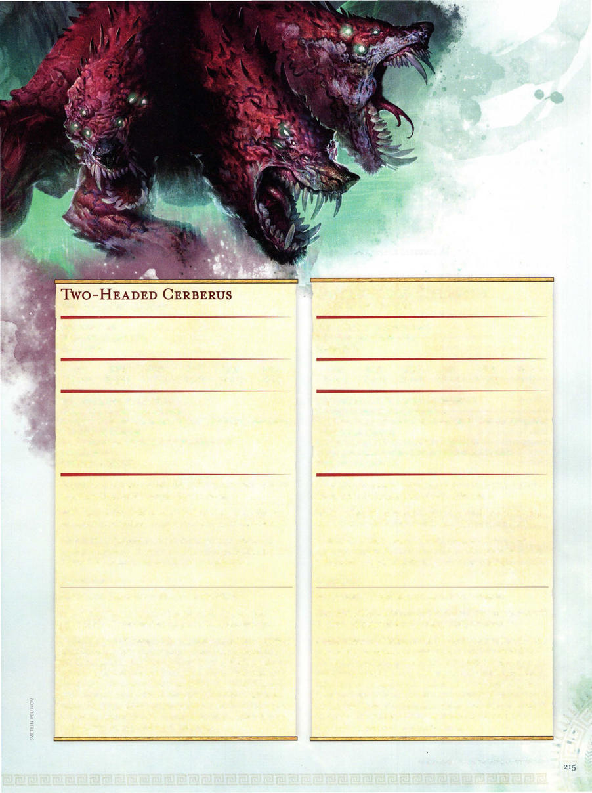

# Underworld Cerberus



```statblock
layout: Basic 5e Layout
name: Underworld Cerberus
size: Large
type: monstrosity
alignment: lawful evil
ac: 16
hp: 104
hit_dice: 11d10 +44
speed: 60 ft.
stats:
- 19
- 12
- 18
- 10
- 16
- 9
cr: '6'
ac_class: natural armor
skillsaves:
- athletics: 7
- perception: 9
- stealth: 4
damage_immunities: fire, necrotic
condition_immunities: blinded, charmed, deafened, exhaustion, frightened, stunned
senses: truesight 30 ft., passive Perception 19
languages: understands all languages but can't speak
traits:
- name: Aggressive
  desc: As a bonus action, the cerberus can move up to its speed toward a hostile creature that it can see.
- name: Multiheaded
  desc: The cerberus can't be surprised, and it has advantage on saving throws against being knocked unconscious.
- name: Pack Tactics
  desc: The cerberus has advantage on an attack roll against a creature if at least one of the cerberus's allies is within 5 feet of the creature and the ally isn't incapacitated.
actions:
- name: Multiattack
  desc: The cerberus makes three bite attacks.
- name: Bite
  desc: 'Melee Weapon Attack: +7 to hit, reach 5 ft., one target. Hit: 11 (2d6 +4) piercing damage plus 3 (1d6) fire damage.'
- name: Breath Weapon (Recharge 5-6)
  desc: The cerberus exhales a 30-foot cone of molten rock. Each creature in the cone must make a DC 15 Dexterity saving throw, taking 21 (6d6) fire damage on a failed save, or half as much damage on a successful one. On a failed save, a creature is also restrained by the hardening rock. A creature can make a DC 15 Strength (Athletics) check as an action, freeing itself or a creature within reach from the rock on a success. The rock has AC 17 and 20 hit points, and it is immune to fire, poison, and psychic damage.
```

*Large monstrosity, lawful evil*

[[../Monsters Glossary|← Monsters Glossary]]

## Source

- [Mythic Odysseys of Theros, p. 215](source_book.pdf#page=215)
