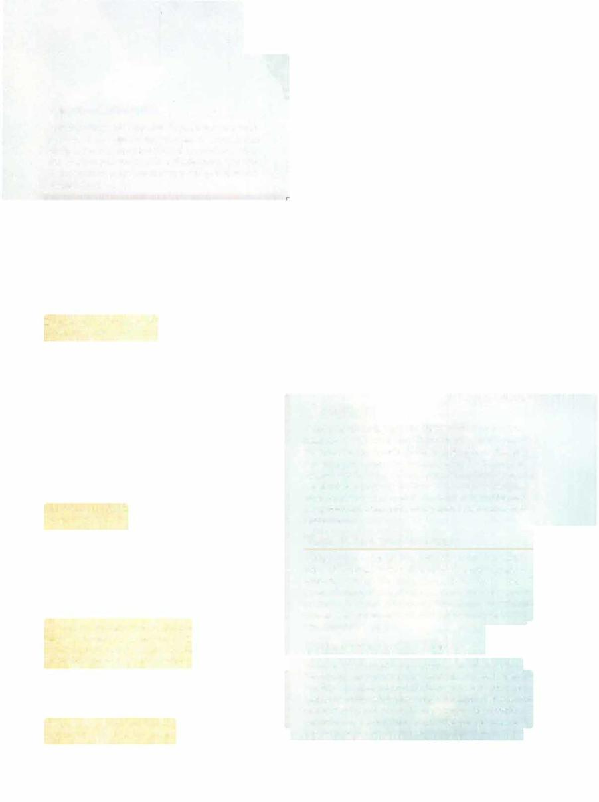

# Winged Bull



```statblock
layout: Basic 5e Layout
name: Winged Bull
size: Large
type: celestial
alignment: unaligned
ac: 12
hp: 95
hit_dice: lOdlO +40
speed: 60 ft., fly 60 ft.
stats:
- 20
- 14
- 18
- 6
- 10
- 5
cr: '4'
senses: passive Perception 10
languages: understands Celestial but can't speak
traits:
- name: Charge
  desc: If the bull moves at least 20 feet straight toward a creature and then hits it with a gore attack on the same turn, the target takes an extra 19 (3d12) piercing damage.
actions:
- name: Gore
  desc: 'Melee Weapon Attack: +7 to hit, reach 5 ft., one target. Hit: 18 (2d12 +5) piercing damage.'
```

*Large celestial, unaligned*

[[../Monsters Glossary|← Monsters Glossary]]

## Source

- [Mythic Odysseys of Theros, p. 214](source_book.pdf#page=214)
